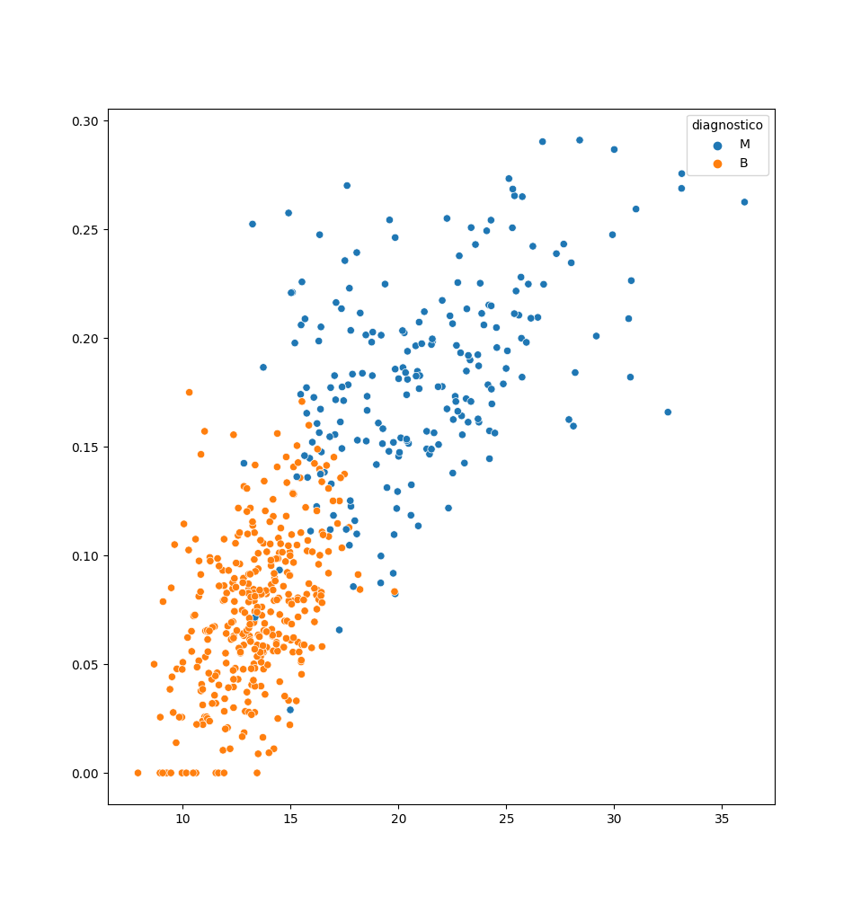
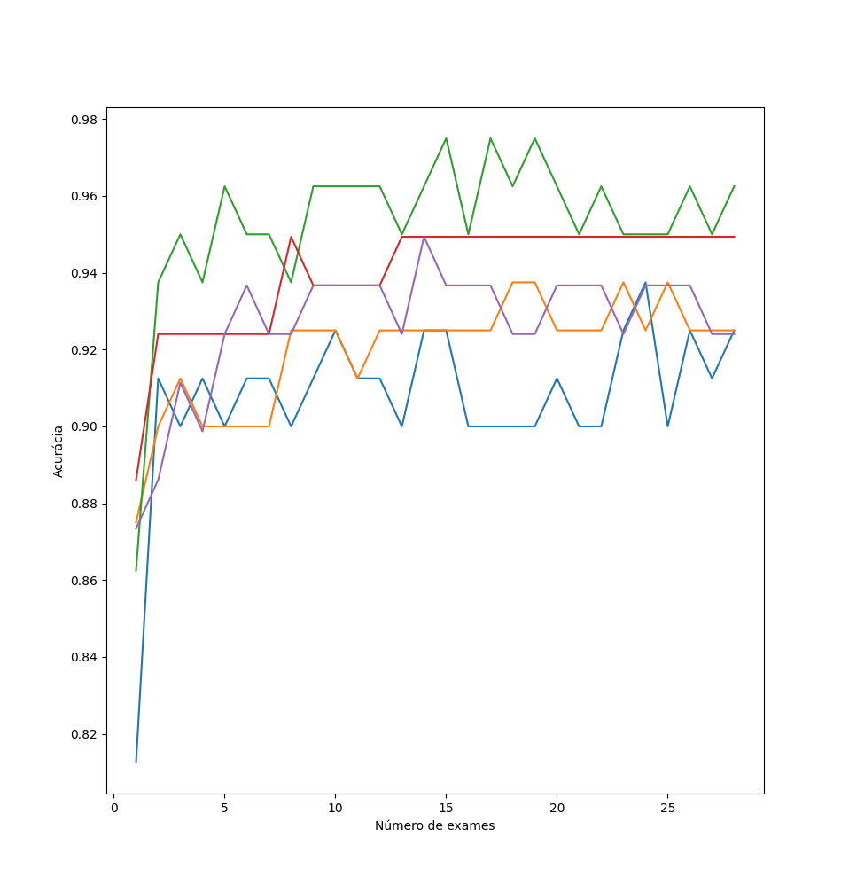

# ⮞ Curso de Machine Learning Alura
# ⮞ Sobre o curso:
- Sempre tive curiosidade em saber como funcionam esses algoritmos que me mandam propaganda de tênis, e EUREKA! Descobri que se tratava de um tal de "Machine Learning", então comecei a ir atrás de estudar esse assunto e é simplesmente incrível ver um código tomando decisões! 
- A linguagem que escolhi foi com base em recomendações de programadores bem renomados... Python, simples e repleta de Libs e conteúdos para fazer uma máquina aprender.
#
# ⮞ Stack:
- Python;
- SkLearn;
- Numpy;
- Pandas;
- Seaborn;
- Matplotlib;
- Graphviz.
#
# ⮞ Destaque do curso:
⮞ Esse foi o destaque principal do curso, ele classifica a possibilidade da pessoa ter câncer com base em dados de exames realizados e históricos pessoais do paciente. Pra mim foi o destaque pois é um algoritmo que consome dados reais e pode ajudar pessoas na vida real:
- [ALURA CARE](https://github.com/PedroLaraa/Curso-MachineLearning-Alura/tree/main/DadosMuitasDimensoes)
-  
</img></img>
